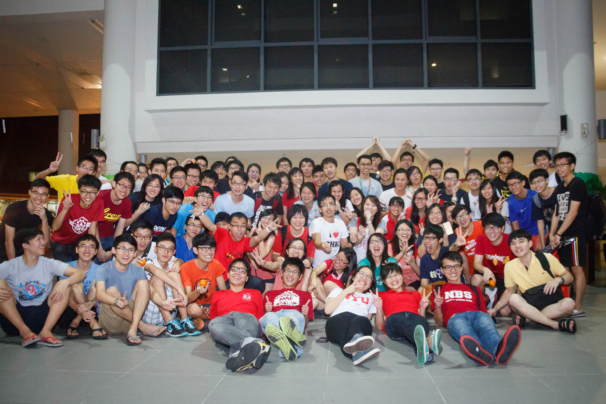

#AMCNY新春联欢后记

星期六(2月7号)当天，为了要办得比往年更好，所以main comm们都得在下午1点钟赶到HSS Foyer做最后的筹备工作。当天都可以看到大家分工合作，例如帮deco布置场地，设置音响和搬运食物等等。除了main com们，也可以看到当天的表演者们马不停蹄地到这里进行他们最后的练习。

当晚的七点钟，AMCNY新春联欢活动也正式开始了。这时，也可以看到人潮开始陆陆续续到登记处报到。不仅如此，也可以看到NUS的独中生们也到来共享新年的气氛。当大家都报了名后，MC 就正式为AMCNY新春联欢 2015 拉开序幕！

大家先是享用丰富的晚餐。不管是来自NTU或者是NUS的同学们，不难看见大家相处的很融洽。紧接着，大家就欣赏二十四节令鼓的帅气表演。他们創作不同的鼓点节奏，搭配吶喊、肢体动作和队形的变化，让大家都不禁对他们的表演赞叹不已。

观赏完了表演，就到了一年一度的捞生活动。不难观察大家在这活动都互相祝福大家身体健康，万事如意等等。接下来当然是让身体活动的时候啦，这时候main com 们都各自负责8个station booth，让大家可以尽情的玩游戏。玩游戏的当儿，当然少不了礼物啦，当天的赢家都可以从各站长中领取礼物! 之后，扯铃的表演者们就正式的出场！当天的扯铃队，虽然有点失水准，但实力还是证明了一切，在大家面前呈现了一场不错的表演。

大家玩了游戏再看了表演后，肚子也开始饿了，这时main comm 们就为大家端上美味可口的汤圆，让大家不仅可以填饱肚子，也可以解渴！最后，在mc说完以后，AMCNY新春联欢也正式结束。虽然main comm们都很累，但看到大家都玩的很尽兴，也不禁地感到开心。这活动不完美的地方，也希望来年可以改进。

